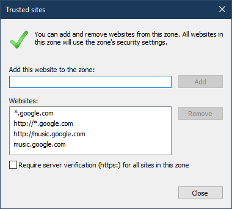

# TrustIE
 
TrustIE allows to edit Internet Explorer's trusted sites zone while avoiding security policies. <a href="https://github.com/DenisLjubarets/TrustIE/raw/master/Files/Trustie_v1.0a.zip">Download TrustIE</a>
 
 

  &nbsp;&nbsp;&nbsp;&nbsp;&nbsp;&nbsp;
  

 

Icons made by <a href="https://www.flaticon.com/authors/freepik" title="Freepik">Freepik</a> from <a href="https://www.flaticon.com/" title="Flaticon">www.flaticon.com</a>

