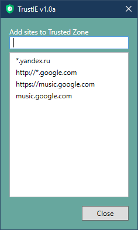

# TrustIE
 
TrustIE allows to edit Trusted Sites zone in Internet Explorer while avoiding security policies. Also allows to edit sites in Java Exceptions. TrustIE requires administrator rights. 

 
<a href="https://github.com/DenisLjubarets/TrustIE/raw/master/Files/Trustie.zip"><b>>> Download <<</b></a> 
 

 
<a href="https://github.com/DenisLjubarets/TrustIE/raw/master/Files/Trustie.zip"><b>>> Download <<</b></a> 
 

Icons made by <a href="https://www.flaticon.com/authors/freepik" title="Freepik">Freepik</a> from <a href="https://www.flaticon.com/" title="Flaticon">www.flaticon.com</a>

